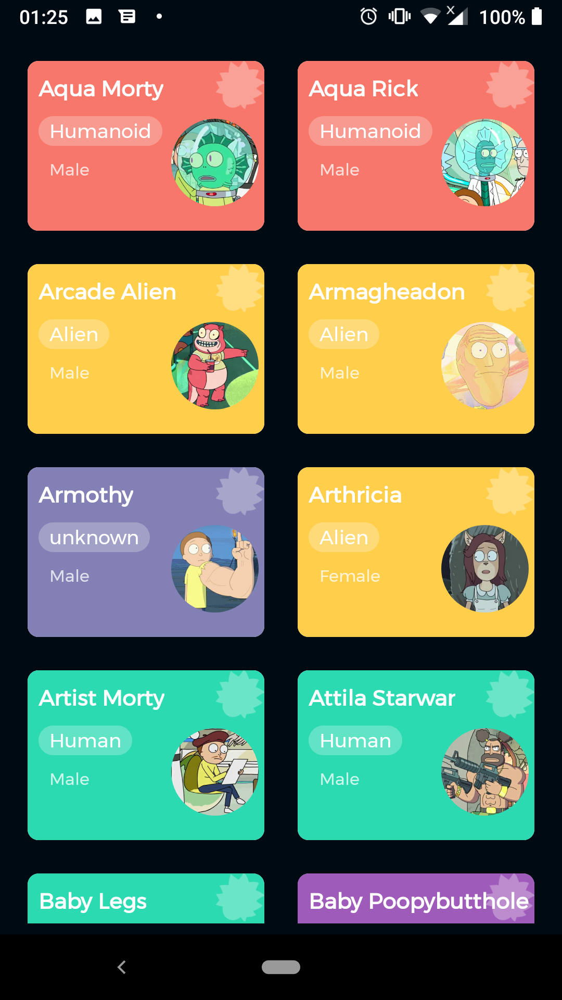
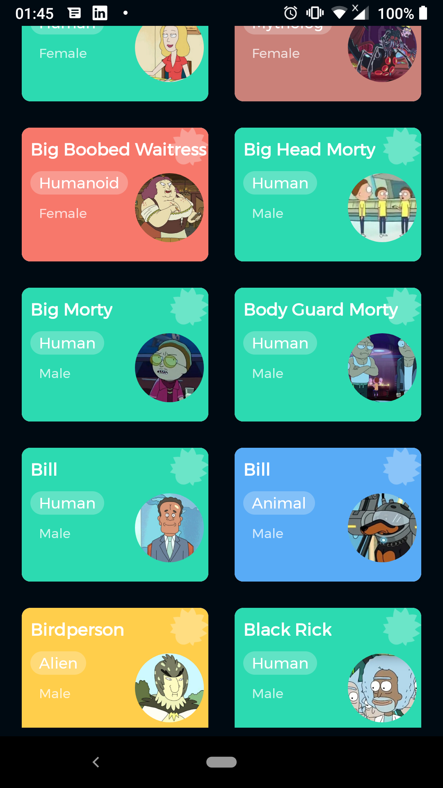

# \[ 🚧 Work in progress 👷‍♀️⛏👷🔧️👷🔧 🚧 \] Rick and Morty App

  

## Screenshots

  
  

## Background

Rick and Morty is a basic application fully written in Kotlin and leverages on key android concepts to allow users to;

- ☑️️View All Characters in Rick & Morty
- ☑️️ Search For Characters based on different criteria
- ☑️️ View the episodes a particular character has appeared in

## Features

- :white_check_mark: Kotlin
- :white_check_mark: MVVM Architecture
- :white_check_mark: Koin Dependency Injection
- :white_check_mark: ViewModel
- :white_check_mark: GraphQL + Coroutines
- :white_check_mark: Live data
- :white_check_mark: Navigation
- :white_check_mark: Local Persistence with Room

## Thanks 🙏🏾
- ✅[mrcsxsiq](https://github.com/mrcsxsiq/Kotlin-Pokedex) for design inspiration based on Kotlin Pokedex
- ✅GraphQL API (https://rickandmortyapi.com/graphql)